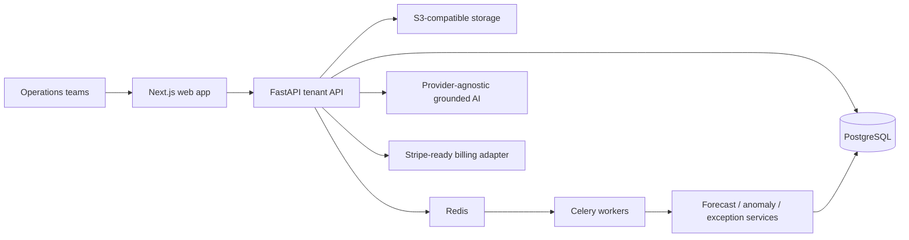

# FlowSight AI

FlowSight AI is a multi-tenant operations and freight intelligence platform for industrial businesses, brokers, carriers, owner-operators, freight forwarders, and shippers. It sits above existing ERP, WMS, TMS, accounting, and spreadsheet workflows to answer what is at risk, what it will cost, who should act, and how freight moves from quote to collected cash.

The repository contains a polished Next.js product experience, a FastAPI domain API, PostgreSQL models and migrations, Redis/Celery jobs, S3-compatible storage, realistic demo tenants, forecasting and anomaly services, tests, and containerized local deployment.

> **Implementation status:** The hosted Vercel experience is a fictional-data browser demo and does not currently call the included API. The FastAPI/PostgreSQL backend runs and is tested separately for local development and production-pilot work. See [the demo deployment guide](docs/DEMO_DEPLOYMENT.md) for deployment caveats.

## Architecture

The diagram below shows the intended production topology.



Tenant identity is carried in every authenticated request and every business table. API queries scope by tenant before applying user filters. High-impact state changes write an audit record. AI summaries receive only tenant-scoped facts and return source citations.

## Start locally

### Windows without Docker

From PowerShell in the project folder:

```powershell
Set-ExecutionPolicy -Scope Process Bypass
.\start-local.ps1
```

The launcher installs missing dependencies, uses a local SQLite database, seeds three demo tenants, rebuilds the app when source files change, starts the web app and API, and opens the browser. Docker is not required. Stop it with:

```powershell
.\stop-local.ps1
```

### Fast path with Docker

1. Copy `.env.example` to `.env` and replace `JWT_SECRET`.
2. Run `docker compose up --build`.
3. Open `http://localhost:3000`.
4. Demo login: `maya@demo.flowsight.ai` / `FlowSightDemo!`.
5. API docs: `http://localhost:8000/docs`.

### Native development

```powershell
pnpm install
pnpm dev

python -m venv .venv
.\.venv\Scripts\pip install -r apps\api\requirements.txt
$env:PYTHONPATH="apps/api"
.\.venv\Scripts\python -m app.seed
.\.venv\Scripts\uvicorn app.main:app --reload --port 8000
```

The API defaults to SQLite for a zero-dependency local start. Docker and production use PostgreSQL.

## Freight Ops expansion

Open `http://localhost:3000/app/freight` for the freight procurement command center. The workflow now starts with a shipment opportunity, ranks qualified carriers, generates copy-ready RFQs, tracks responses, compares bids, recommends a winner, records the award rationale, and exports a procurement summary. Existing broker/carrier operations remain available under Freight Operations, including mode analytics, tenders, deterministic pricing, invoicing, and the client-safe shipper portal.

The canonical freight graph is shared across procurement and operations. Opportunity, carrier qualification, RFQ, bid, award, tender, shipment, quote, and invoice history remain connected. Role-aware API serializers remove internal cost, margin, approval trace, and internal notes from client responses rather than maintaining a second copy.

Freight plans are represented by Starter ($249/month), Growth ($599/month), and Pro ($1,250/month) product defaults. See [docs/FREIGHT_OPS.md](docs/FREIGHT_OPS.md) for the operating model and clean-room pricing rules.

## Deploy a private demo

For a limited audience, deploy the web demo and enable the built-in access gate with `DEMO_ACCESS_ENABLED=true`, `DEMO_ACCESS_USERNAME`, and `DEMO_ACCESS_PASSWORD`. The included `vercel.json` is configured for a no-Docker Vercel deployment from the repository root. See [docs/DEMO_DEPLOYMENT.md](docs/DEMO_DEPLOYMENT.md).

## Verify

```powershell
pnpm test
pnpm build
$env:PYTHONPATH="apps/api"
.\.venv\Scripts\pytest apps\api\tests
```

## Repository map

- `apps/web`: marketing, authentication, onboarding, operations control tower, Freight Ops, quote desk, shipper portal, invoicing, reports, feedback, and administration.
- `apps/api`: tenant-safe API, canonical freight graph, deterministic pricing, invoice workflows, domain services, connectors, storage abstraction, seeds, migrations, and tests.
- `docs`: architecture decisions, API and data contract, demo script, deployment, admin, and end-user guides.
- `.github/workflows/ci.yml`: build and test gates.

## Commercial defaults

The product includes Pilot, Starter, Growth, and Scale entitlements. The paid pilot is set to the blueprint’s recommended $2,500 one-time offer, credited upon conversion. The demo emphasizes measurable risk and time-to-value rather than generic AI claims.

See [docs/ARCHITECTURE.md](docs/ARCHITECTURE.md) for the system design and [docs/DEMO_SCRIPT.md](docs/DEMO_SCRIPT.md) for the sales path.
